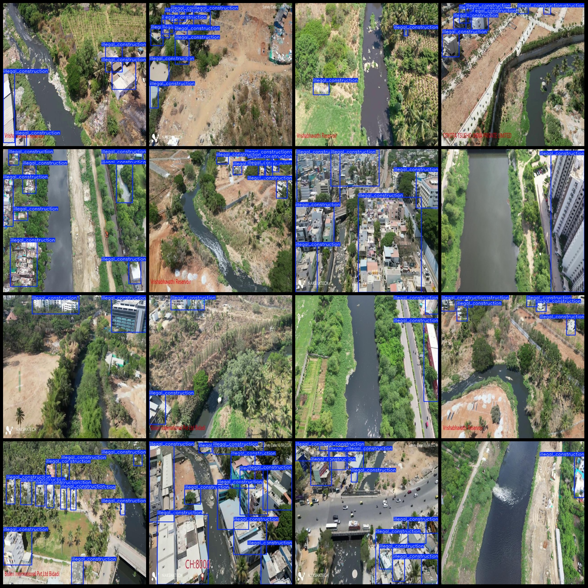
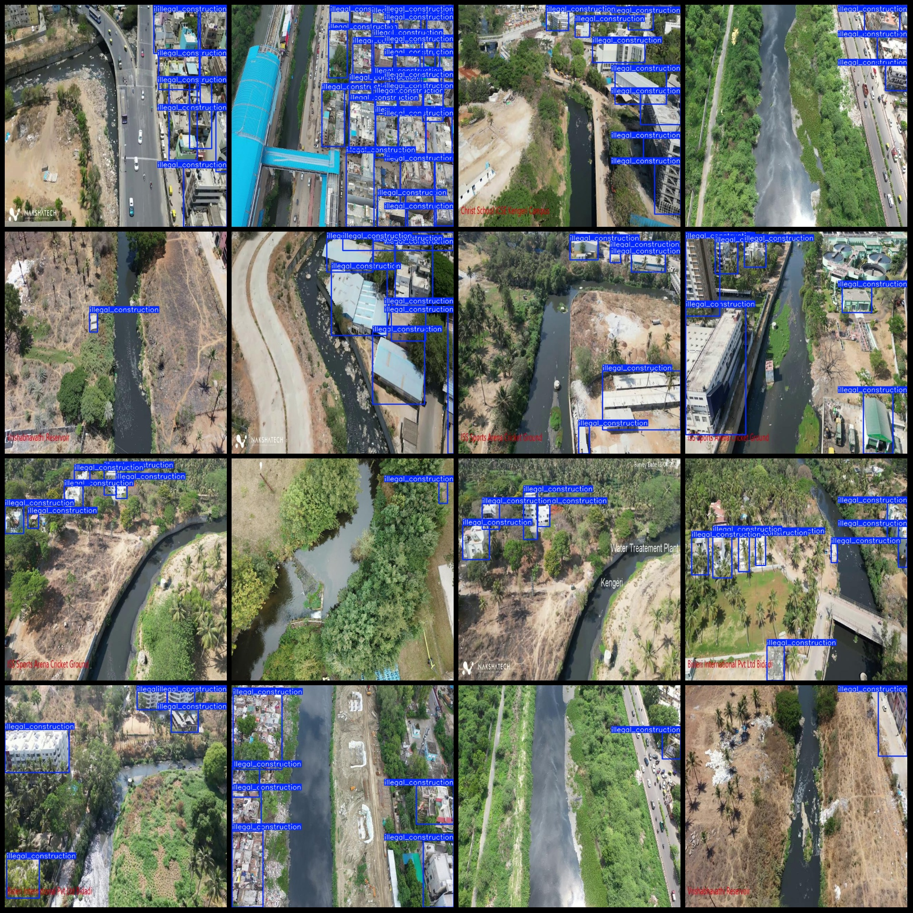

# UAV Perspective Intelligent River Monitoring and Illegal Construction Detection Data Set (VOC+YOLO)

## Dataset Format: Pascal VOC format + YOLO format (excluding split path txt files, only containing jpg images along with corresponding VOC format xml files and YOLO format txt files)

### Number of Images (jpg file count): 1034
### Number of Annotations (xml file count): 1034
### Number of Annotations (txt file count): 1034
### Number of Annotation Categories: 1

The dataset is organized as follows:
- **Pascal VOC format**: Only contains jpg images.
- **YOLO format**: Includes jpg images, corresponding VOC format xml files, and YOLO format txt files.

#### Image Count (jpg file count): 1034
#### Annotation Count (xml file count): 1034
#### Annotation Count (txt file count): 1034
#### Number of Annotation Categories: 1

The number of boxes for each category in "illegal_construction" (illegal construction) is 5935, total boxes = 5935.

#### Image Resolution: 640x640
#### Drone: DJI MAVIC 3
#### Collection Height: 100m
#### Collection Angle: 90°
#### Annotation Tool: labelImg
#### Annotation Rules: Draw a box around the category

#### Special Notes: The dataset does not have been split into training, validation, or test sets; you will need to do this yourself.

#### Special Remarks: This dataset does not guarantee any accuracy of trained models or weight files.

#### Image Preview:

#### Example of Annotation:

## Images

Here is a pay link on Stripe ( https://buy.stripe.com/3cs8yP7sY87d0vu9AB ). Please contact me lonlonago@foxmail.com after funding $89, and I will send you a complete data files , thank you!

